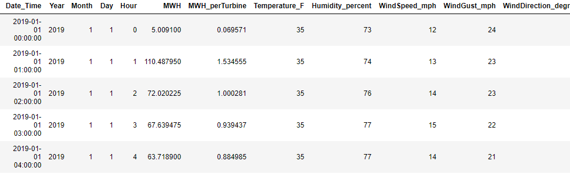
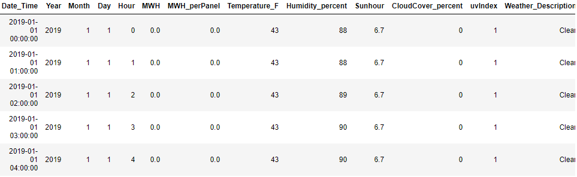
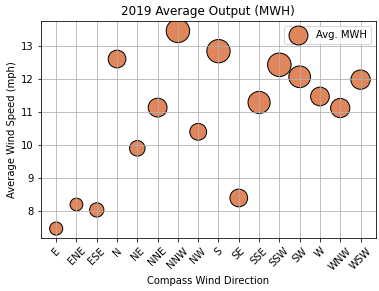

# Austin Energy Predictor

---
# Table of Contents
* [Overview](#overview)
* [Datasets](#datasets)
* [Database](#database)
* [Methodology](#methodology)
* [Model](#model)
* [Dashboard](#dashboard)
* [Team](#team)
* [Technologies](#technologies)
* [Acknowledgements](#acknowledgements)
* [Resources](#resources)

## Project Outline for Dashboard
https://docs.google.com/document/d/1zy57lRIQJ1UBqlNrTapLSL0aPm6nbZYgNquwGzL_J9k/edit

## Project Presentation
Access the GoogleSlides at this link: https://docs.google.com/presentation/d/1bD3JhPvRM_7ClN2xdoWEC1OZS5LJlWrjyJesHR8705s/edit#slide=id.ga1bdb9328c_0_10

    
# Overview
--- 
The objective of the Austin Energy Predictor is to determine energy output (megawatt-hour, Mwh) per renewable energy farm, specifically wind and solar. Our team is collaborating with [Austin Energy](https://austinenergy.com/ae/about) to help produce vital data insights into their renewable energy farms. By utilizing a machine learning model, Austin Energy will have a more refined understanding of its overall energy output. Therefore, Austin Energy can forecast energy production from their various plants and thus better schedule power generation.

Austin Energy has provided the team with hourly megawatt (Mwh) data from their Hackberry Wind Farm and Webberville Solar Farm over all of 2019 to train the machine learning model. Also, hourly historical weather data for each farm is included in training the model. The combination of hourly megawatt (Mwh) and weather data allows the model to predict energy output based on weather factors - such as temperature, wind speed and direction, and cloud coverage. 

By training the model on a full years' data, the model comprises weather variations that are observed across different seasons. Therefore, the team used January - July 2020 hourly megawatt (Mwh) and weather data for the above renewable energy farms to test the model and evaluate its accuracy. 

The data insights generated by the model are vital since renewable energy generation varies continuously throughout the day based on available wind and sunshine. The goal is to eventually utilize the model on all of Austin Energy's renewable energy farms and expand the model to include peak power generation times. Therefore, Austin Energy will be able to predict when renewable energy being generated will be highest. 

Potential additional ways forward also include expanding this model for consumer applications.  For consumers who want to be energy conscious, they could choose when to run their products and appliances off of mainly renewable energy. By knowing when the grid mix is predominantly renewables, energy consumption could be scheduled around these times. 

# Datasets
---
The machine learning model is fed two types of data - weather data and energy output (Mwh). Specifically, the model is using Hackberry Wind Farm output (Mwh), Webberville Solar Farm output (Mwh), and historical weather data for each farm. The historical weather data for each farm has also been combined with the respective energy outputs (Mwh) to create two separate datasets - one for wind energy and one for solar. 

The 2019 data from each dataset is extracted to train the model. Then, each dataset is divided into features and the target variable. The historical weather data is the features (independent variables) input into the machine learning model, and the energy output (Mwh) is the target (dependent variable) the model is predicting. The machine learning model is then tested with 2020 data from January through July. 

After achieving an accurate model, forecasted weather data makes energy output (Mwh) predictions for Austin Energy's wind and solar farms over the specified time frame. 

## Weather Data
The machine learning model uses two forms of weather data. The first is historical weather data used to train the model, and the second is forecasted weather data used to make future energy output (Mwh) predictions. To view the API sources, visit the [World Weather Online API](https://www.worldweatheronline.com/developer/) for historical weather data and [Open Weather API](https://openweathermap.org/api) for forecasted weather data. 

Using the [Local Historical Weather API](https://www.worldweatheronline.com/developer/api/docs/local-city-town-weather-api.aspx), historical weather data can be pulled from any location given a date range and geographic coordinates. Multiple calls were made to the World Weather Online server using APIs to collect hourly historical weather data for the Hackberry Wind Farm and Webberville Solar Farm locations. To ease merging the weather datasets of each farm with the respective energy output datasets, the time frames of these datasets are the same. Therefore, the data collected extends from January 1, 2019 - July 31, 2020. 

To Create your Own API Key, Visit this link: https://www.worldweatheronline.com/developer/my/analytics.aspx?key_id=222419

## Energy Output (Mwh) Data
Our team is very fortunate for this opportunity to work with Austin Energy on this project. Austin Energy has given the team access to energy output (Mwh) data for two of their renewable energy farms in Texas - Hackberry Wind Farm and Webberville Solar Farm. 

Hackberry Wind Farm is located west of Dallas, and Webberville Solar Farm is located just outside of Austin. The location of both renewable energy farms as well as Austin Energy's additional energy farms can be observed below:

Both of these datasets (found under "Resources") are provided directly by Austin Energy and contain the hourly output of the wind/solar farm in Mwh. Take a look below for additional information on each of these farms:

[Hackberry Wind Farm](https://www.thewindpower.net/windfarm_en_4012_hackberry.php) -
* City: Albany, Shackelford
* Commissioning: 2008
* 72 turbines: Siemens SWT-2.3-93 (power 2 300 kW, diameter 93 m)
* Hub height: 80 m
* Total nominal power: 165,600 kW
* Latitude: 32° 46' 34"
* Longitude: -99° 28' 35.2"

[Webberville Solar Farm](http://webbervillesolar.com/) -
* City: Manor, Texas
* Commissioning: 2012
* 127,278 PV panels
* Total nominal power: 35,000 kw
* Latitude: 30° 14' 18"
* Longitude: -97° 30' 31"

# Database 
---
The database used for this project is a MongoDB Atlas database hosted on an AWS server. The historical weather data and renewable energy outputs (Mwh) have been cleaned and merged on a DateTime stamp before inerting the data into the database. The main database is the wind-solar-database, which houses two collections - a wind data collection and a solar data collection. These collections can be accessed using the PyMongo driver and a connection string along with a username and password given to each member of the team.

## Schema
- Insert Schema HERE

## Collections
* wind_data collection

The wind_data collection consists of the cleaned historical wind weather data merged with the cleaned Hackberry Wind Farm data. The data ranges from January 1, 2019 - July 31, 2020. 

* solar_data

The solar_data collection consists of the cleaned historical solar weather data merged with the cleaned Webberville Solar Farm data. The data ranges from January 1, 2019 - July 31, 2020. 

## Connection String
The connection string is copied from the mongo db atlas databse. The username and password are stored in a seperate config file. The default database is set to the wind_solar_data database.

# Methodology
---
The team performed the following steps to create an accurate machine learning model. 

## ETL: Extract, Transform, Load
Flat files containing, historical hourly power generated from Hackbarry Wind Farm and Webberville Solar Farm was been provided by Austin Energy. Based on the historical dates of the power data, an API call was made at https://www.worldweatheronline.com/ to extract the historical weather data in an hourly format into a dataframe. The date and hourly time were merged in preparation of the dataframe in the datetime format (YYYY-MM-DD HH:MM:SS). The weather parameters were further cleaned up to convert them to integers.

A similar process was followed in converting the historical hourly power from Hackbarry Wind Farm and Webberville Solar Farm to prepare the dataframe in the datetime format. These two dataframes could then be easily merged on the datetime to create a single dataframe with all the weather parameters needed for analysis along with the power generation in Mega Watt Hour (MWH). Once merged, the datetime was split into year, month, day and hour as a final dataframe for Exploratory Analysis, Preprocessing and Machine Learning. The dataframe was converted to JSON format and stored in MongoDB.

### Hackberry Wind MWH DataFrame

### Webberville Solar MWH DataFrame

## Exploratory Analysis

The focus of the exploratory analysis initially was to determine the obvious relationship between various weather parameters such as
* Wind speed
* Wind direction
* Humidity
* Temperature
* Sun hours (based on seasons)
* Cloud cover percentage

to the power generated.  In addition, statistical analysis of the above parameters and power generation as performed.

### Relationship of Wind Speed and Wind Direction to the MWH

Deeper analysis can be found here (https://docs.google.com/document/d/1E3OqpVhLlet5KkGYFaULLPAGrmxt4cUYSkAvx2JLoBg/edit).

## Preprocessing
The data is largely already preprocessed. The only thing to do is to drop the \_id column which is an artifact of the mongodb atlas storage and encod the weather description using one hot encoding.

The data is split by using the 2019 data to train and the 2020 data to test. The data is then scaled using sklearn standard scaler.

- Description of Preprocessing
- Takes in data from database
- Output label for input data
- Feature selection
- Encoding 
- Scaling 
- How data was split into training / testing sets

# Model
---
### Machine Learning Model Selection Process
The goal of the project is to predict the energy generation of renewable energy farms using weather forcast data. This means that we are looking for a model with a continuous output and therefore need some type of regression model. The two we have decided to use are a multiple linear regression and a neural network. Both models will be trained on the solar and wind data sperately.

## Multiple Linear Regression
The linear regression model we are using is the linear model from sklearn. This allows us to perform a multiple linear regression on the weather data to predict a continuous output. This model is good at handling linear relationships between data but cannot handle other types of relationships without more data preprocessing. This resulted in a low accuracy for both models. The loss metric is the mean absolute error.

The solar linear regression acheived an accuracy of ~60%. This closely resembled the shape of the data but could not predict the value of the power generated very well. This is likey because the relationship between the data points is more complicated than the regression model can handle. In addition, the linear regression can output negative values. This is problematic because this is impossible for a solar panel. To compensate for this all negative values have been coerced to 0. The optimizer used is a stocastic gradient decent (SGD). There are three hidden layers to the model all using a RELU activation function.

The wind linear regression acheived an accuracy of ~30% and had many of the same pitfalls of the solar regression. The output of the regression gave an imporession of the shape but did not get close to the correct values. The output of the wind farm is not as easily predicted as the solar farm likey due to the major impact of the sun on the solar panels. The optimizer used is ADAM. There are 2 hidden layers allusing an activation function.

## Neural Network
The neural network we are using is the sequential model from tensor flow. This is able to handle more complex relationships between the data. The two models are very similar. Both use a relu function output to ensure that the output is continuous and non negative. This is particularly important for the solar data because it has more values close to zero because it is not generating at night.

The solar model has a mean absolute error of about 1.5 MWH. It can predict very well the output during the day and is nearly perfect at predicting when the panels will start producing.

The wind model has a mean absolute error of about 25 MWH. This means that the data take the shape of the output well but sometime is off my a fair amount.

### Limitations
The biggest limitation is the amount of historical data we have. It only has one data point for each date and so having more data would help this greatly. This would also help to take into account the degradation of the solar panels to make the model more accurate for future years.

## Benefits
- Neural Network can be used by Austin Energy to test other farms they own with forecasted weather data to predict power generation. 

# Dashboard
---
- Preliminary Dashboard Deployed via Heroku:  https://austin-green-energy-predictor.herokuapp.com/

## Tools Used
- HTML, Bootstrap, CSS, FLASK
- Next step is connecting Mongo with Heroku

## Interactive Elements
- Google Map with Aus. green energy locations mapped.  Popup markers contain additonal details on plant/farm

# Team
---
## Team Members
* [Oshadi](https://github.com/oshadiw)
    * Circle Role:
        * Created dashboard layout and attributes 
    * X Role:
        * Performed Market/ Technology Research on Wind Power Plants in Texas
        * Performed Technology Research on which visualization tools (i.e., FlaskApp, GitHub Pages, Heroku) will be best to display project

* [Mel](https://github.com/msindrasena)
    * Triangle Role:
        * Performed exploratory data analysis using Pandas
    * X Role:
        * Performed Technology Research on which resources are best for historical and forecasted weather API calls
        * Performed as team leader to ensure group is staying on track with project deliverables 
    * Circle Role:
        * Generating three images to use in presentation with dashboard for exploratory analysis

* [Rahul](https://github.com/madarahr)
    * Square Role:
        * Performed machine learning preprocessing 
        * Refine machine learning model
    * Triangle Role:
        * Performed ETL process on weather data and Hackberry Wind Farm data 
        * Merged weather and wind farm dataframes 
        * Performed exploratory data analysis using Pandas
        * Created a simple machine learning model (multiple linear regression model)
    * X Role:
        * Performed Research on wind farm power generation factors
    * Circle:
        * Refine the analysis using weather forcast to generate plots for display in presentation

* [Collin](https://github.com/collinsculley)
    * Circle Role:
        * Created dashboard layout with HTML, Bootstrap, CSS
        * Created Flask app route and index.html template connection
        * Created Procfile for Heroku connection
    * X Role:
        * Created preliminary project Flow Chart
        * Organized GoogleSlides presentation
        * Deployed Dashboard via Heroku

* [Shayna](https://github.com/shayna-UT)
    * Square Role:
        * Performed machine learning preprocessing 
    * Triange Role:
        * Wrote script to pull weather data using an API call and store the data into a Pandas DataFrame
        * Automated ETL process by refactoring the code into functions
    * X Role:
        * Performed Technology Research on which resources are best for historical and forecasted weather API calls

* [Duvey](https://github.com/Duvey314)
    * Square Role:
        * Set up the GitHub repository 
        * Refine machine learning model
    * Triangle Role:
        * Formatted the connection string used to connect to MongoDB
        * Granted MongoDB read access to all team members, and helped team members establish connection to the database 
        * Created a simple machine learning model (multiple linear regression model)
    * Circle Role:
        * In charge of managinging the MongoDB Integration (Database Administrator)
    * X Role: 
        * Performed Market/ Technology Research with Austin Energy

# Technologies
--- 
## ETL: Extract, Transform, Load

Flat files containing, historical hourly power generated from Hackbarry Wind Farm and Webberville Solar Farm was been provided by Austin Energy.  Based on the historical dates of the power data, an API call was made at https://www.worldweatheronline.com/ to extract the historical weather data in an hourly format into a dataframe.  The date and hourly time were merged in preparation of the dataframe in the datetime format (YYYY-MM-DD HH:MM:SS).  The weather parameters were further cleaned up to convert them to integers.

A similar process was followed in converting the historical hourly power from Hackbarry Wind Farm and Webberville Solar Farm to prepare the dataframe in the datetime format.  These two dataframes could then be easily merged on the datetime to create a single dataframe with all the weather parameters needed for analysis along with the power generation in Mega Watt Hour (MWH).  Once merged, the datetime was split into year, month, day and hour as a final dataframe for Exploratory Analysis, Preprocessing and Machine Learning. The dataframe was converted to JSON format and stored in MongoDB.

### Hackberry Wind MWH DataFrame

### Webberville Solar MWH DataFrame

## Exploratory Analysis 

The exploratory analysis is to determine the relationship between various weather parameters such as

* Wind speed
* Wind direction
* Wind gusts
* Humidity
* Temperature
* Sun hours (based on seasons)
* Cloud cover percentage

to the power generated.  In addition, statistical analysis of the above parameters and power generation was performed.

### Relationship of Wind Speed and Wind Direction to the MWH

Further detail of this analysis can be found here.

## Preprocessing 
* Python
    * Tools:
        * Pandas
    * Libraries:
        * Imblearn
        * SciKitLearn
## Machine Learning 
* Python
    * Tools:
        * Pandas
    * Libraries:
        * SciKitLearn
## Data Storage 
* MongoDB Atlas
* PyMongo
## Visualizations 
* JavaScript
* HTML
* CSS
* GoogleSlides
* Microsoft Power Bi

The final dashboard is able to display forecasted weather from any wind and solar farm location for the next few days and predict the power generation.  In addition, the current MWH power generation is presented for visualization.

 

# Acknowledgements
---
* Kasun Chandrarathna (Xcel Employee):
    * Electrical Engineer at [Xcel Energy](https://www.xcelenergy.com/)
    * Provided information on how wind turbines are made and how power is generated and coverted to the grid.
* [Austin Energy](https://austinenergy.com/ae/about)

# Resources
---
## Historical Weather Data and Forecasts
* [World Weather Online](https://www.worldweatheronline.com/developer/)
    * "Weather API and Data for Businesses and Developers"
    * Used API to call historical weather data. 
* [Open Weather API](https://openweathermap.org/api)
    * Used API to call forecasted weather data. 

## Additional Resources Explored
* [Power Partner Thermostat Program](https://data.austintexas.gov/Utilities-and-City-Services/Power-Partner-Thermostat-Program/7jgb-hbdr)
    * "Power Partner was launched in 2013 and is a voluntary program for residential customers who use internet-connected thermostats."
    * Potential Application: Could be used to interpolate peak demand. 
* [Generation Mix to Meet Total Austin Energy Load](https://austinenergy.com/ae/about/environment/renewable-power-generation)
    * The widget shows the "percentages of renewable and nonrenewable power being generated right now, in real time, as it relates to our customers' demand."
    * Potential Application: Webscraper could collect the widget data.
* [National Oceanic and Atmospheric Administration](https://www.goes.noaa.gov/)
    * "The National Oceanic and Atmospheric Administration is an American scientific agency within the United States Department of Commerce that focuses on the conditions of the oceans, major waterways, and the atmosphere."
    * Potential Application: Access public weather data.
* [Austin Energy System Peak Demand](https://data.austintexas.gov/resource/a6pm-qynf.json)
    * Day of peak power generation (Mw) for the city of Austin from 2006 to 2019. 
    * Potential Application: Could be used to predict the peak demand day in Austin for upcoming years. 
* [ERCOT](http://www.ercot.com/gridinfo/generation)
    * "This page provides current information on Generation Resources, including forecast and actual generation."
    * Potential Application: Compare ERCOT generation to Austin Energy Generation. 
